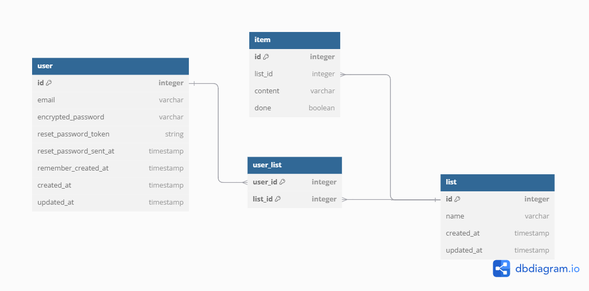
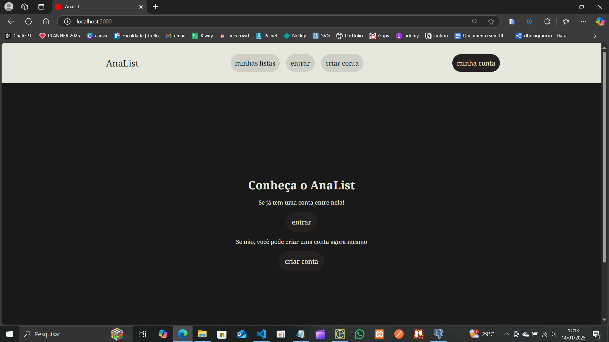
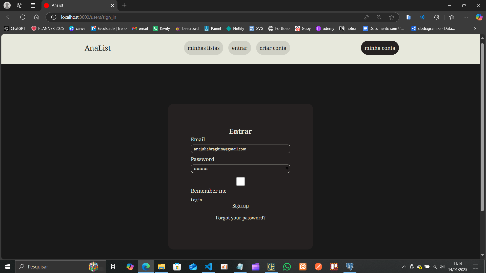
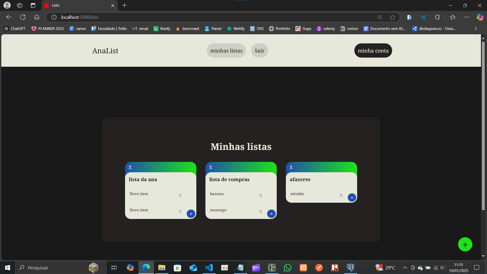
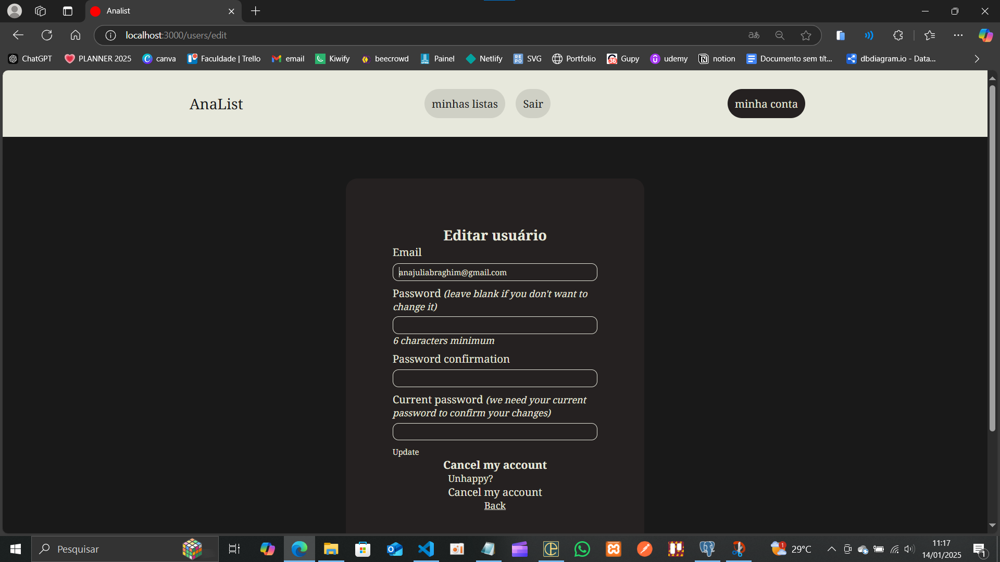

# AnaList

AnaList é uma aplicação de to-do list desenvolvida em **Ruby on Rails** para ajudá-lo a organizar e gerenciar suas tarefas de forma prática e eficiente.

## Funcionalidades
- **CRUD de Usuários:** 
  - Crie, edite, visualize e exclua sua conta.
- **CRUD de Listas:** 
  - Gerencie suas listas de tarefas, adicionando e organizando múltiplas listas.
- **CRUD de Itens:** 
  - Adicione, edite e exclua itens específicos de suas listas.

## Tecnologias Utilizadas
- **Ruby on Rails:** Framework principal utilizado no desenvolvimento.
- **PostgreSQL:** Banco de dados utilizado para armazenar informações de usuários, listas e itens.

## Modelagem do banco de dados do site

## Imagens do site

